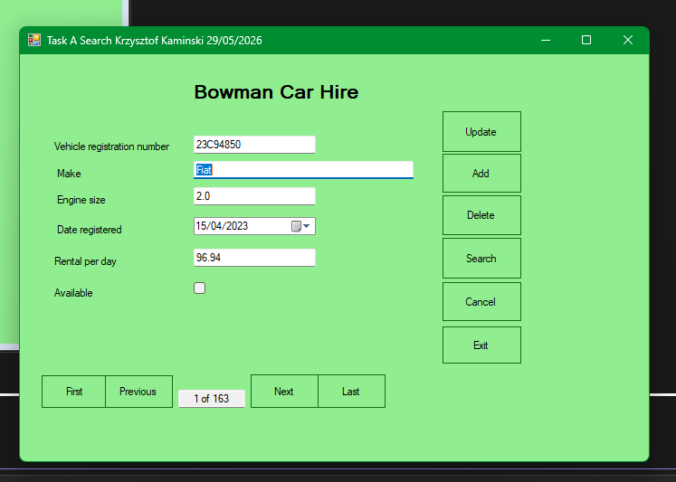
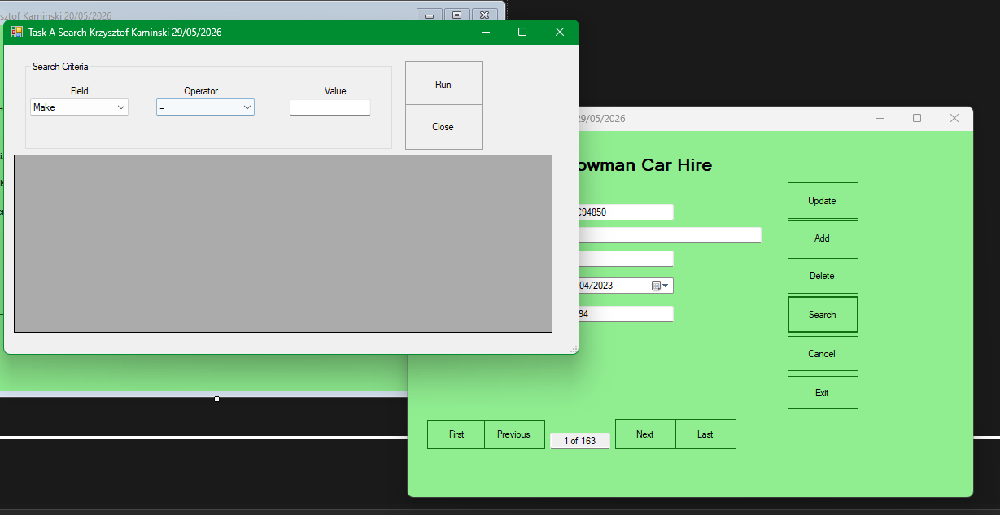
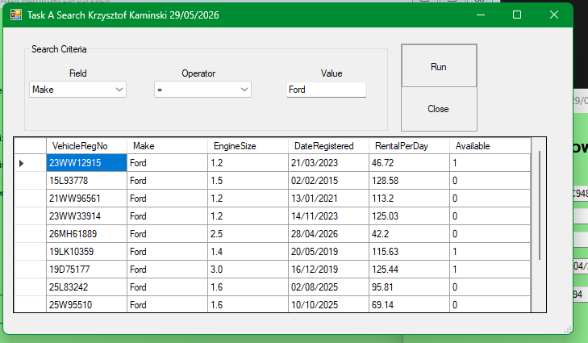
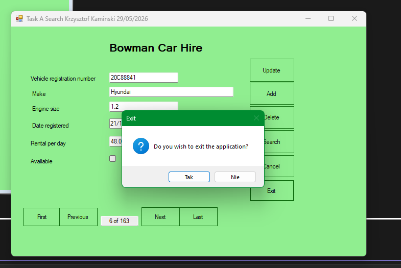

# Cars Database - Windows Forms Application

## Overview

Cars Database is a desktop application developed in C# using Windows Forms and SQLite.

The application allows users to manage car hire records through a graphical interface and perform full CRUD operations.

## Features

* Display individual records
* Add new records
* Update existing records
* Delete records
* Search records
* Cancel unsaved changes
* Navigate through records
* SQLite database integration
* Error handling using try/catch

## Technologies Used

* C#
* Windows Forms
* SQLite
* ADO.NET
* Visual Studio

## Screenshots

### Main Form

### Search Form

### Search Results

### Exit Confirmation

## Database Structure

Table: tblCar

Fields:

* VehicleRegNo (Primary Key)
* Make
* EngineSize
* DateRegistered
* RentalPerDay
* Available

## Author

Krzysztof Kaminski
